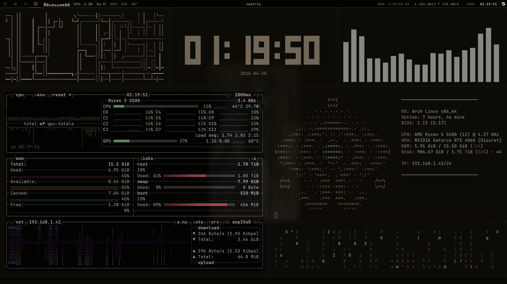

# dotfiles



all colors and themes are auto-generated from the wallpaper using [pywal](https://github.com/dylanaraps/pywal).

## Stack

| Component | Tool |
|-----------|------|
| OS | Arch Linux |
| WM | [Hyprland](https://hyprland.org) |
| Bar | Waybar |
| Terminal | Kitty |
| Shell | Zsh + Starship |
| Launcher | Rofi |
| Theming | pywal → Kvantum, qt6ct, GTK, Waybar, Rofi, Cava, Kitty |
| Fetch | Fastfetch |
| Audio visualizer | Cava |
| Resource monitor | Btop |

## Structure

```
dotfiles/
├── .config/
│   ├── hypr/          # Hyprland, monitors, workspaces
│   ├── waybar/        # Bar config and styles
│   ├── kitty/         # Terminal
│   ├── rofi/          # Launcher theme
│   ├── wal/           # Pywal color templates
│   ├── starship.toml  # Shell prompt
│   ├── cava/          # Audio visualizer
│   ├── btop/          # Resource monitor
│   ├── fastfetch/     # System fetch
│   ├── gtk-3.0/       # GTK3 theme
│   ├── gtk-4.0/       # GTK4 theme
│   ├── Kvantum/       # Qt theme engine
│   ├── qt6ct/         # Qt6 appearance
│   └── scripts/       # Helper scripts
└── home/
    ├── .zshrc
    └── .zprofile
```

## Install

```bash
git clone https://github.com/tomasEtchecopar/dotfiles ~/.dotfiles
cd ~/.dotfiles
./install.sh
```

The script symlinks all configs to their expected locations and backs up any existing files as `*.bak`.
